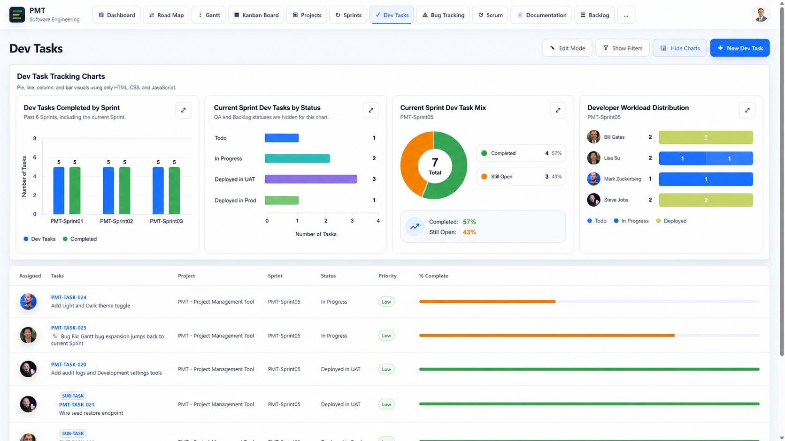
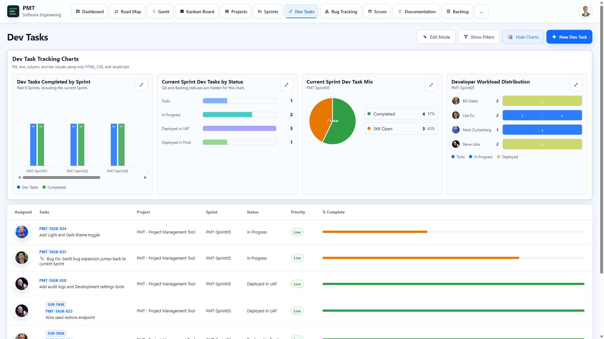
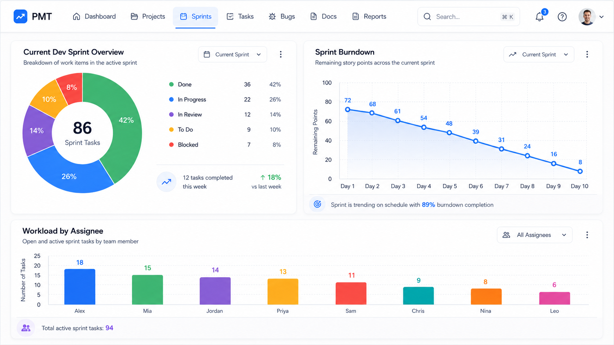

# Codex Task: Modernize PMT Dev Tasks Charts Section Using Target Reference

## Goal

Update **only** the **Dev Tasks chart section** in PMT so it matches the polished chart design shown in:

```text
pmt-dev-tasks-charts-target-reference.png
```

This target reference is the latest generated mockup from the design conversation. It shows the current PMT Dev Tasks page with the chart cards modernized while keeping the rest of the page unchanged.

Use this image as the primary visual target:

```md

```

Also compare against the current PMT screenshot:

```md

```

And use this earlier dashboard/chart style image as a secondary style reference:

```md

```

## Important Scope Boundary

Focus **exclusively** on the Dev Tasks chart section.

Do **not** redesign or materially change:

- top navigation
- avatar menu
- page heading
- toolbar buttons
- filter behavior
- Dev Tasks table
- table rows
- task row ordering
- dialogs
- backend APIs
- SQL scripts
- stored procedures
- DTOs/models

The Dev Tasks table and everything else on the PMT page should remain as-is.

The only page area to modernize is:

```text
Dev Tasks -> Dev Task Tracking Charts
```

## Repo Context

PMT is a pure frontend JavaScript/HTML/CSS app served by ASP.NET Core .NET 6 with SQL Server stored-procedure data access.

Relevant repo structure:

```text
wwwroot/js/features/tasks/
wwwroot/js/components/
wwwroot/js/core/
wwwroot/css/features/
wwwroot/css/components/
wwwroot/css/themes.css
wwwroot/css/tokens.css
wwwroot/css/base.css
docs/ui-design-system.md
docs/manual-smoke-test.md
```

Follow existing repo guidance:

- Use native JavaScript ES modules.
- Do not add React, Vue, Angular, TypeScript, a bundler, or a new charting library.
- Preserve endpoint contracts and current `localStorage` keys.
- Keep light and dark themes on the same markup/component CSS.
- Use theme tokens instead of hard-coded one-off colors where practical.
- Avoid inline styles except CSS custom-property values or geometry that must be calculated dynamically.
- Hover/focus/pressed states must not move, resize, scale, or shift cards, rows, buttons, charts, or controls.
- Use solid colors by default.
- Completion/success-rate visuals should remain:
  - `0–30%` danger/red
  - `31–79%` warning/orange
  - `80–100%` success/green

## Files to Inspect First

Start with:

```text
AGENTS.md
wwwroot/AGENTS.md
docs/ui-design-system.md
docs/manual-smoke-test.md
```

Then inspect the current chart implementation:

```text
wwwroot/js/features/tasks/tasks.js
wwwroot/css/features/tasks.css
wwwroot/css/themes.css
wwwroot/css/tokens.css
wwwroot/css/base.css
wwwroot/js/components/
wwwroot/css/components/
```

If the chart helpers are shared with Bug Tracking or Dashboard charts, avoid broad breaking changes. Prefer Dev Tasks-specific selectors or non-breaking shared component improvements.

## Existing Screen Data Requirement

Use **real PMT data already shown on the Dev Tasks screen**.

Do **not** hard-code demo data from the image.

The target reference shows the expected visual output using the current visible sample data, but the implemented charts must continue to be powered by PMT’s existing state/API data.

Keep these data flows dynamic:

- sprint chart counts
- current sprint status counts
- completed vs still-open mix
- developer workload distribution
- table rows
- filters
- chart drilldown/expand behavior

## Target Visual Direction

Modernize the Dev Task chart area to match the target reference:

```text
pmt-dev-tasks-charts-target-reference.png
```

The result should look like the current PMT page except that the chart section has been upgraded with:

- cleaner white chart cards
- subtle cool-gray borders
- soft shadows
- more rounded card corners
- cleaner internal spacing
- stronger chart titles
- more readable subtitles
- richer chart colors
- cleaner legends
- clearer data labels
- modern expand/action buttons
- better chart spacing and alignment
- less cramped chart content
- more polished SaaS-dashboard aesthetics

Keep PMT’s current light theme shell intact.

## Chart Section Container

The chart section headed **Dev Task Tracking Charts** should become a polished dashboard panel.

Preserve the current section title and subtitle text:

```text
Dev Task Tracking Charts
Pie, line, column, and bar visuals using only HTML, CSS, and JavaScript.
```

Recommended design treatment:

- background: `var(--color-surface)`
- border: `1px solid var(--color-border)`
- border-radius: `var(--radius-lg)` or `var(--radius-xl)`
- box-shadow: `var(--shadow-card)` or a subtle compact shadow
- padding around the whole section
- four chart cards arranged in a row at wide desktop width
- responsive wrapping or horizontal containment at laptop width without overlap

Do not make the chart section visually heavier than the task table.

## Shared Chart Card Treatment

Each of the four chart cards should look like a modern dashboard card:

- white/raised surface
- rounded corners
- subtle border
- soft shadow
- consistent padding
- title at top-left
- subtitle below title
- small rounded expand/action button at top-right
- chart body with enough breathing room
- compact legend/summary area
- clean typography and improved alignment

Use semantic tokens where possible:

```css
background: var(--color-surface);
border: var(--border-width) solid var(--color-border);
border-radius: var(--radius-lg);
box-shadow: var(--shadow-compact);
color: var(--color-text-primary);
```

Use current class names if they already exist. Do not create duplicate wrapper structures if there is already a chart-card component/class.

## Chart 1: Dev Tasks Completed by Sprint

Title and subtitle should remain:

```text
Dev Tasks Completed by Sprint
Past 6 Sprints, including the current Sprint.
```

Keep it as a grouped vertical bar chart using real sprint data.

From the current screenshot, the visible example data is:

```text
PMT-Sprint01: Dev Tasks 5, Completed 5
PMT-Sprint02: Dev Tasks 5, Completed 5
PMT-Sprint03: Dev Tasks 5, Completed 5
```

Implementation requirements:

- continue using dynamic sprint data
- keep the two-series comparison: `Dev Tasks` and `Completed`
- use a vibrant PMT blue for Dev Tasks
- use success green for Completed
- use cleaner, lighter gridlines
- show clear y-axis labeling, preferably `Number of Tasks`
- show readable value labels above bars when supported
- use a compact legend with colored dots/swatches
- keep any existing scroll/overflow for more than the visible sprint set

Visual target:

- bars should be more refined and vibrant
- spacing should be cleaner
- gridlines should be subtle
- card should look premium like the target reference

## Chart 2: Current Sprint Dev Tasks by Status

Title and subtitle should remain:

```text
Current Sprint Dev Tasks by Status
QA and Backlog statuses are hidden for this chart.
```

Keep it as a horizontal bar chart using real status totals.

From the current screenshot, the visible example data is:

```text
Todo: 1
In Progress: 2
Deployed in UAT: 3
Deployed in Prod: 1
```

Implementation requirements:

- continue using dynamic current-sprint status data
- keep QA and Backlog excluded exactly as current behavior does
- use clean horizontal bars
- use rounded bar ends if practical
- align counts clearly on the right
- keep status labels readable
- use status-aware colors if the existing status lookup supplies them
- otherwise use stable chart/status tokens
- add or preserve an x-axis label such as `Number of Tasks` if the current implementation supports it cleanly

Visual target:

- less cramped than current
- more vibrant
- cleaner spacing between status rows
- more premium card treatment

## Chart 3: Current Sprint Dev Task Mix

Title and subtitle should remain:

```text
Current Sprint Dev Task Mix
PMT-Sprint05
```

Keep the chart dynamic based on selected/current sprint.

From the current screenshot, the visible example data is:

```text
Completed: 4, 57%
Still Open: 3, 43%
Total: 7
```

Implementation requirements:

- use real completed/open task counts
- prefer a donut chart rather than a flat pie chart if the existing HTML/CSS implementation can support it simply
- center label should show total count clearly:
  - `7`
  - `Total`
- show a polished legend/summary for:
  - Completed count and percent
  - Still Open count and percent
- use success green for Completed
- use warning/orange for Still Open
- preserve any current drilldown/expand behavior

Visual target:

- green/orange donut similar to the target image
- center total should be crisp
- legend rows should look like refined dashboard summary rows
- optional bottom insight strip is acceptable if simple and theme-safe

## Chart 4: Developer Workload Distribution

Title and subtitle should remain:

```text
Developer Workload Distribution
PMT-Sprint05
```

Keep the chart dynamic based on selected/current sprint.

From the current screenshot, the visible example data is:

```text
Bill Gates: 2 deployed
Lisa Su: 1 todo, 1 in progress
Mark Zuckerberg: 1 todo
Steve Jobs: 2 deployed
```

Implementation requirements:

- continue using real assignee/workload data
- preserve avatar display
- keep stacked horizontal bars
- keep labels and counts readable
- use a compact legend for:
  - Todo
  - In Progress
  - Deployed
- use a vibrant but restrained color mapping:
  - Todo: PMT blue
  - In Progress: teal/cyan or chart token
  - Deployed: success green
- align developer rows cleanly
- use consistent row spacing
- keep any current chart drilldown/expand behavior

Visual target:

- cleaner avatar/name/count alignment
- more polished stacked bars
- stronger contrast
- less visual clutter
- modern legend treatment

## Color and Token Guidance

Prefer existing semantic tokens.

Use or refine these token families if already present:

```css
--color-primary
--color-success
--color-warning
--color-info
--chart-1
--chart-2
--chart-3
--chart-4
--color-chart-gridline
--color-chart-axis
--color-chart-mark-text
--color-border
--color-border-subtle
--color-surface
--color-surface-raised
--shadow-card
--shadow-compact
```

Avoid direct hard-coded colors unless:

1. the existing chart implementation already uses local CSS variables, or
2. the hard-coded value is isolated and clearly necessary for a chart mark.

Even then, prefer setting local CSS variables once on the chart/card rather than scattering values.

## Suggested CSS Direction

Use the actual existing class names after inspection. This is illustrative only:

```css
.dev-task-charts-panel {
  background: var(--color-surface);
  border: var(--border-width) solid var(--color-border);
  border-radius: var(--radius-xl);
  box-shadow: var(--shadow-card);
  padding: var(--space-7);
}

.dev-task-chart-grid {
  display: grid;
  grid-template-columns: repeat(4, minmax(0, 1fr));
  gap: var(--space-6);
}

.dev-task-chart-card {
  background: var(--color-surface);
  border: var(--border-width) solid var(--color-border);
  border-radius: var(--radius-lg);
  box-shadow: var(--shadow-compact);
  padding: var(--space-6);
  min-width: 0;
}

.dev-task-chart-card h3 {
  color: var(--color-text-primary);
  font-size: var(--font-size-lg);
  font-weight: var(--font-weight-bold);
  line-height: var(--line-height-heading);
  margin: 0;
}

.dev-task-chart-card .chart-subtitle {
  color: var(--color-text-secondary);
  font-size: var(--font-size-sm);
  margin-top: var(--space-1);
}
```

Do not paste these selectors blindly if the repo already has better existing names. Adapt to the current code.

## Preferred Implementation Approach

1. Locate the Dev Tasks chart rendering code.
2. Identify the existing chart card wrapper, chart body, legend, expand button, and chart mark classes.
3. Keep data calculations unchanged.
4. Keep chart click/drilldown/expand handlers unchanged.
5. Add or refine semantic classes as needed.
6. Move visual changes into CSS.
7. Avoid rewriting chart rendering unless the current markup cannot support the desired card structure.
8. If small markup changes are required, keep them minimal and screen-owned inside the Dev Tasks feature.
9. Ensure Light Theme looks like the target reference.
10. Check Dark Theme still renders and remains readable, but do not redesign Dark Theme in this task.

## Do Not Do

Do not:

- replace chart logic with static mock data
- add Chart.js, Recharts, D3, or any external dependency
- add a build step
- change backend APIs
- change SQL
- change table layout
- redesign task rows
- redesign navigation
- alter Dev Task CRUD behavior
- remove existing accessibility attributes
- introduce layout-shifting hover effects
- break the chart expand/drilldown behavior

## Accessibility Requirements

Preserve or improve:

- chart expand/action button accessible labels
- keyboard focus visibility
- readable color contrast
- text labels/legends for chart colors
- status values visible as text, not only color
- accessible summaries if existing chart markup includes them

## Responsive Requirements

Check at:

```text
1366 x 768
1920 x 1080
```

Requirements:

- chart cards do not overlap
- legends remain readable
- labels do not collide
- chart section does not force unwanted page-level horizontal scrolling
- table remains unchanged below the charts
- toolbar remains unchanged above the charts

If four cards are too tight at laptop width, prefer responsive wrapping or contained horizontal scroll for the chart cards without changing the rest of the page.

## Verification

Run:

```powershell
git status --short
dotnet restore
dotnet build
npm.cmd run check:js
npm.cmd run test:js
npm.cmd run test:browser
git diff --check
```

Manual check:

```text
1. Start PMT.
2. Open http://localhost:5056.
3. Log in if needed.
4. Switch to Light Theme.
5. Open Dev Tasks.
6. Turn charts on.
7. Compare the chart section against pmt-dev-tasks-charts-target-reference.png.
8. Confirm the table below the charts did not change.
9. Confirm Show Filters, Hide Charts, Edit Mode, and New Dev Task still work.
10. Confirm each chart still uses real PMT data.
11. Confirm chart expand/drilldown behavior still works.
12. Refresh the page and confirm chart/filter/theme state remains valid.
13. Check browser console for uncaught errors.
14. Repeat at 1366x768 and 1920x1080.
```

## Acceptance Criteria

This task is complete when:

- Only the Dev Tasks chart section has been visually modernized.
- The chart section closely resembles `pmt-dev-tasks-charts-target-reference.png`.
- Current PMT Dev Tasks data still drives all four charts.
- The Dev Tasks table is unchanged.
- Top navigation and toolbar are unchanged.
- Chart cards have modern white surfaces, rounded corners, subtle borders, soft shadows, refined typography, and vibrant readable chart colors.
- All four chart cards still render:
  - Dev Tasks Completed by Sprint
  - Current Sprint Dev Tasks by Status
  - Current Sprint Dev Task Mix
  - Developer Workload Distribution
- Chart expand/drilldown behavior still works.
- Show/Hide Charts still works.
- Filters still work.
- Light Theme is polished.
- Dark Theme is not broken.
- No backend/API/SQL changes were introduced.
- No console errors or test failures were introduced.

## Codex Response Requested

After implementation, summarize:

- files changed
- what changed in chart markup
- what changed in chart CSS
- whether theme tokens were adjusted
- how real data was preserved
- tests run and results
- any intentional deviations from the target reference
